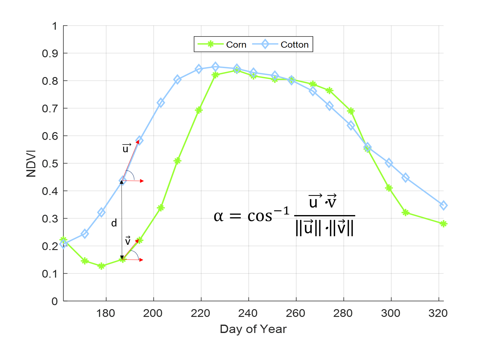

This repository contains implementation of vector dynamic time warping method. 
This method computes optimal warping path between two signals by using vector distances. 

## Files
VDTW.m: VDTW Matlab implementation
vdtw.c: VDTW Matlab Mex implementation

TEST_TimeSeries_Classification: Main test code, it contains classifiers VDTW, DTW and SAM. 
